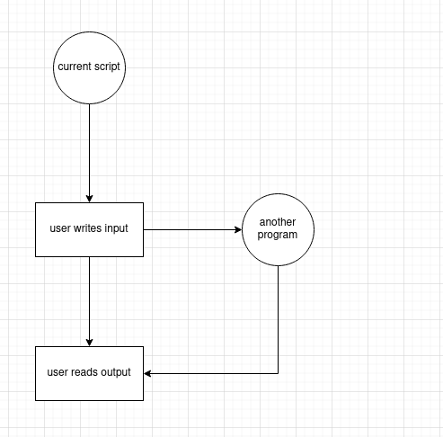

# Assistant

this is a project for personal use only.

### The problem

For professional purposes it is imperative that I get a portfolio, or any way to show off in a user-friendly way the projects I have done, the skills I have and basically what I am capable of, this idea do not need to show the whole technical documentation, for that I would use the README.md or API.md on each repo, In this project I want to only show **what exactly** is the project, a way for the user to actually taste it without the need of any deployments or extra steps on his machine.

### Solution

To solve this need, I decided I wanted to make a website where the user could 'execute' the programs I wanted to show, the user will interact with them, I also will need to enable a feature to let the user get in contact with me. At this point I realized that the project would require a least 2 different parts.
- Client/Website
- Server/API
This document focuses on the process related to the server only.

### Approach

The problem is divided into 4 relevant parts
1. Program interaction
2. API with support for Sockets and HTTP requests
3. Discord bot capable to send DM to users
4. Interoperability between the API and the Discord bot

#### 1. Program interaction

I have a Python script that will need to execute another program that might or might not be written in python, it could be an executable, an interpreted program, and so on. This hypothetic Python script will also be capable to **read** as string the output given after each input and **write** an input given by the user as string, and last but not least, terminate the program.

What I expect to create is called [terminal emulator](https://en.wikipedia.org/wiki/Terminal_emulator) that can be accesible from the API, this is not new concept since that is basically what we use on editors like VSCode or online playgrounds like [python online interpreters](https://www.programiz.com/python-programming/online-compiler/) where you can interact with the program you write.


_Picture 1._

As we can see in picture 1, the interaction with an external program requires the creation of a subprocess, that take us to the [subprocess package](https://docs.python.org/3/library/subprocess.html) where you can spawn child subprocesses born from the main script. After trying to set up the communication I realized that there are only two ways to interact with such subprocess, first is through the `communicate` method, which after given input and return the output, will close the subprocess, which is not what I expect because of the need of keeping the program alive as long as the user wants. The other way was through the `stdin` and `stdout` properties, where you read and write the values, but this approach is not recommended for according to the docs.
> Warning: Use communicate() rather than .stdin.write, .stdout.read or .stderr.read to avoid deadlocks due to any of the other OS pipe buffers filling up and blocking the child process. 

Looking for alternatives, I found the [pexpect](https://pexpect.readthedocs.io/en/stable/) module for '_spawning child applications and controlling them automatically_' which called my attention. It has the same features as the `subprocess` module. Once solved that part, I encountered one challenge more, I cannot read the whole output of the program.

##### Attempt 1
I tried using `readlines` but as the documentation states
> Remember, because this reads until EOF that means the child process should have closed its stdout.

It means that when once I run that it will close my process for future inputs, which is not my expected behaviour. Anyways when I try it I get the following
```
def read(self):    
    return list(self.process.readlines())
```
For a reason unknown to me the program just does nothing, prints nothing, raises no error, just stays paused with no output whatsoever.

##### Attempt 2
Read each line until finding an emty line like this
```py
def read(self):
    val = self.process.readline()
    result = ""
    while val != "":
        result += val        
        val = self.process.readline()
    return result
```
Once again the same problem, the program pauses, prints no input, does nothing for a few seconds then it prints the following error
`pexpect.exceptions.TIMEOUT: Timeout exceeded.`

##### Attempt 3
using `read_nonblocking` causes my program to read only a few characters, so I use the first parameter `size` as follows.
```py
def read(self):
    return self.process.read_nonblocking(999999999)
```
Only then I get the expected behavior.

#### 2. API with support for Sockets and HTTP requests

I selected [Flask](https://flask.palletsprojects.com/en/2.2.x/) for its simplicity and the [Socket.io plugin](https://flask-socketio.readthedocs.io/en/latest/) On this step, no major issues were found on server side.

There were declared two endpoints
1. `/contact`: allowing only POST methods, this endpoint is for the contact.
2. `/ping`: a test endpoint to make sure the server is running.


And 3 socket events
1. `initialize`: this event starts an executable program and returns its first output.
2. `command`: this event sends the user input, writes it in the subprocess and returns on the same event the command output.
3. the `connect` and `disconnect` default events are used for instantiation of the terminal emulator and kill of the child subprocess respectively.

#### 3. Discord bot capable to send DM to users

I chose [discord.py](https://discordpy.readthedocs.io/en/stable/) and implemented it in a functional way for I only needed 1 or 2 commands, one for syncronization of app command, 2 to let me know my discord user ID (this because I was unable to find it by myself).

There is a third behavior that the bot has but it is not accesible through any user interation, this method makes the bot to send a DM to a user from given ID, this function will later be used by the API.

#### 4. Interoperability between the API and the Discord bot

What I want to achieve is simple: to be able to execute succesfully the hidden function of the bot from the `contact` endpoint of the API but this has shown to be the most challenging task of all in the project.

##### Attempt 1

Using the [asyncio](https://docs.python.org/3/library/asyncio.html) module.
```py
from server import socketio, app
from bot import bot
from dotenv import load_dotenv
import os
import asyncio

env_path = os.path.dirname(__file__) + "/.env"
load_dotenv(env_path)

async def start_server():
    socketio.run(app)

async def start_bot():
    token = os.getenv("BOT_TOKEN")
    await bot.start(token)

async def main():
    task1 = asyncio.create_task(start_bot())
    task2 = asyncio.create_task(start_server())

    await task1
    await task2
if __name__ == "__main__":
    try:
        asyncio.run(main())
    except KeyboardInterrupt:
        print("Program exited")
```

But this raises the error of `RuntimeError: You cannot use AsyncToSync in the same thread as an async event loop - just await the async function directly.` or starts only one of the programs, either the bot or the server, given that case it is impossible to know if the communication is actually possible.

##### Attempt 2

Using the [multiprocessing](https://docs.python.org/3/library/multiprocessing.html) module

```py
from server import socketio, app
from bot import bot
from dotenv import load_dotenv
import os
import multiprocessing

env_path = os.path.dirname(__file__) + "/.env"
load_dotenv(env_path)

def start_server():
    socketio.run(app)

def start_bot():
    token = os.getenv("BOT_TOKEN")
    bot.run(token)

if __name__ == "__main__":
    bot_thread = multiprocessing.Process(name="bot_thread", target=start_bot)
    server_thread = multiprocessing.Process(name="server_thread", target=start_server)

    bot_thread.start()
    server_thread.start()
```

But at the time of calling the desired function on the designated endpoint, the error `AttributeError: '_MissingSentinel' object has no attribute 'is_set' on concurrent tasks` raises, this is due to the method `run` starts its own event loop process by itself so it is impossible to communicate with it.

##### Attempt 3

Using other concurrent approaches like:

